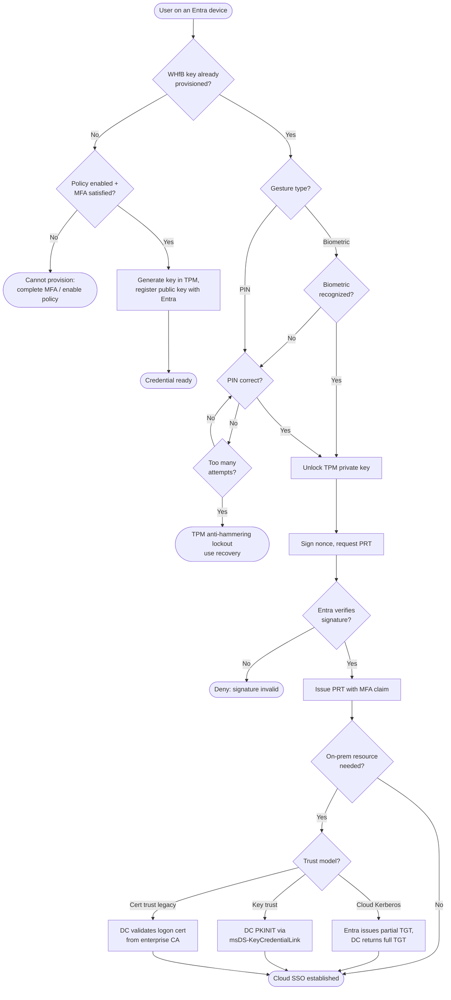

# Windows Hello for Business — Decision Flowchart

Provisioning eligibility, then the logon gesture and trust-model decisions. Deny paths
terminate explicitly.

Notes

- Provisioning is gated on both policy being enabled and a fresh MFA; the resulting key is
  a reusable proof of that MFA.
- PIN and biometric both resolve to unlocking the same TPM-held private key — the gesture
  is local, only the signature leaves the device.
- Cloud Kerberos trust is the recommended on-prem path; certificate trust is legacy.
