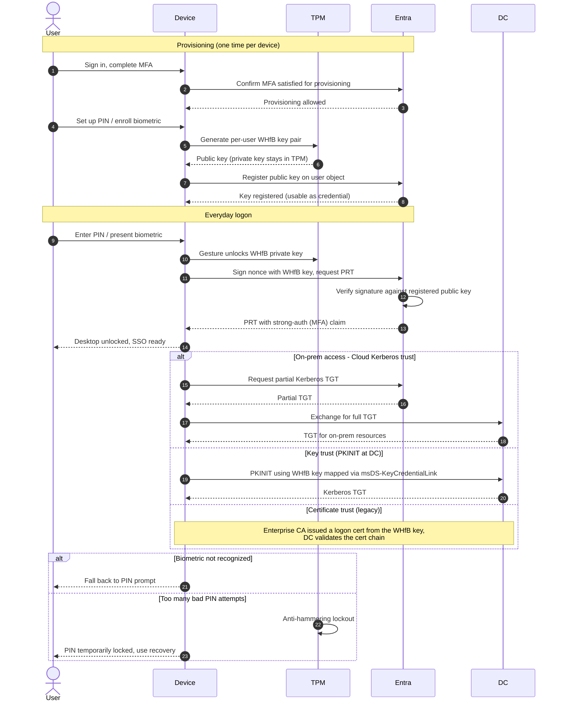

# Windows Hello for Business — Sequence Diagram

Happy path first (provisioning, then gesture logon), followed by on-prem access via the
trust models, biometric fallback, and PIN lockout.

Notes

- Provisioning requires a prior MFA, the WHfB key then becomes a portable proof of that
  strong authentication for future sign-ins.
- The private key never leaves the TPM, only signatures do, so the credential cannot be
  phished or replayed from another device.
- Cloud Kerberos trust is preferred over certificate trust because it needs no per-device
  certificate deployment.
