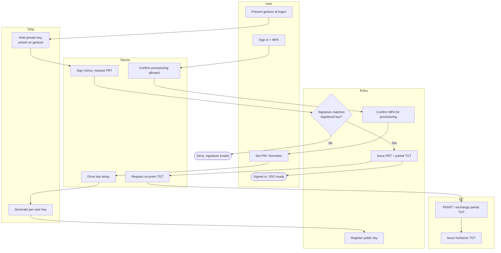

# Windows Hello for Business — Swimlane

One lane per component. The DC lane participates only for on-prem resource access.

Notes

- Provisioning (top) happens once per device and depends on a prior MFA at `E1`.
- Everyday logon is the gesture -> TPM -> signed nonce -> Entra path; on-prem access
  extends through the DC lane via Cloud Kerberos or key trust.
