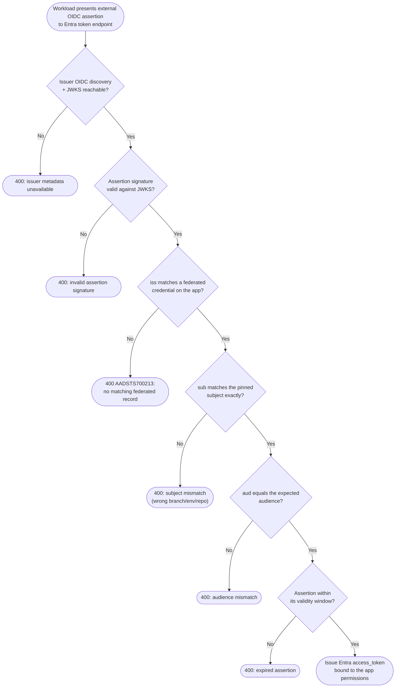

# Entra Workload Identity Federation — Decision Flowchart

Every claim Entra checks on the external assertion, with explicit deny terminals.

Notes

- All four claim gates (`Iss`, `Sub`, `Aud`, `Exp`) must pass; the tight `Sub` match is the main
  scoping control.
- No stored secret is involved — a compromised external signing key or a loose `Sub` are the
  realistic risks.
- The issued token is a normal Entra access token, subsequently validated by the target API.
