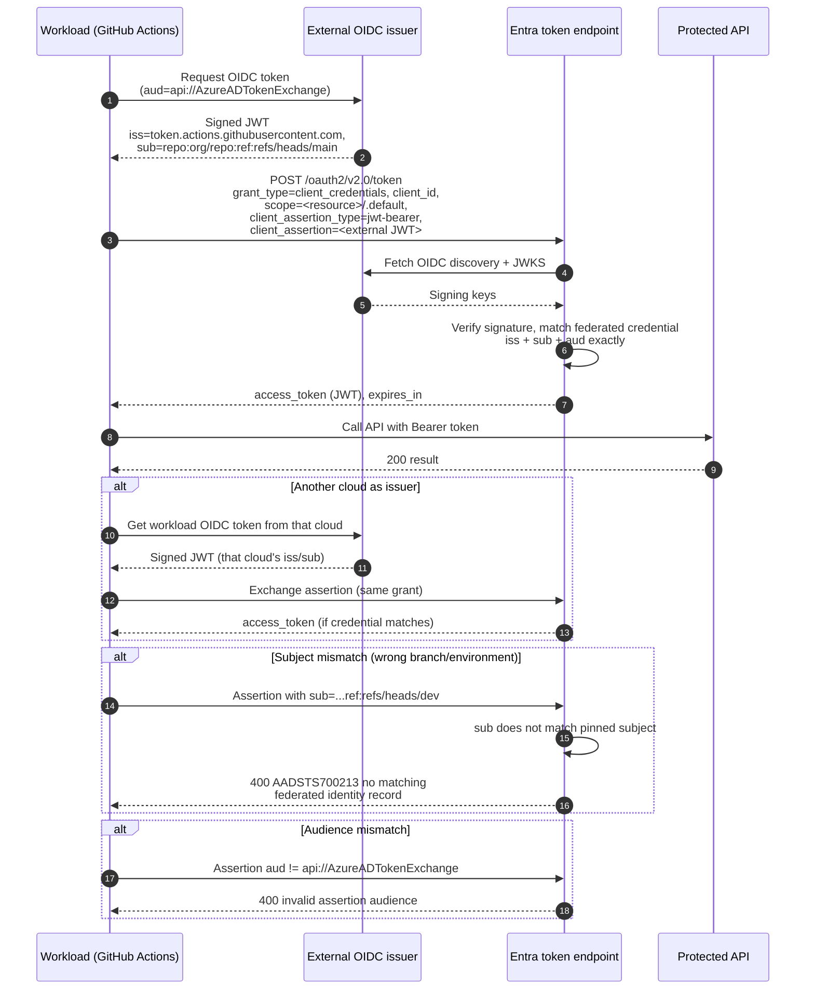

# Entra Workload Identity Federation — Sequence Diagram

Happy path first (a GitHub Actions job mints an OIDC token and exchanges it for an Entra access
token), then alternates: another cloud as the issuer, a subject mismatch, and an audience
mismatch.

Notes

- No client secret is stored in Entra, trust rests entirely on the pinned `iss`/`sub`/`aud` and
  the external issuer's signing keys fetched from its JWKS.
- The external assertion is short-lived, Entra still issues its own standard access token bound to
  the app's permissions.
- Subject matching is exact, a different branch, tag, or environment yields a different `sub` and
  is rejected.
