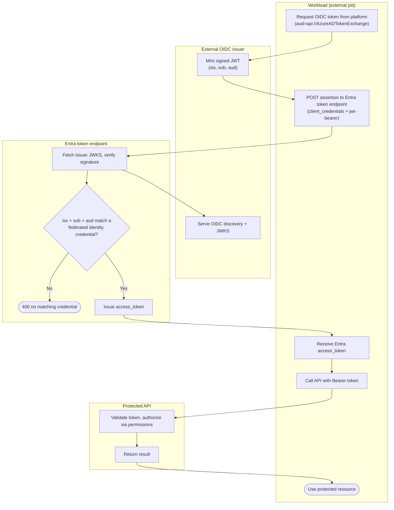

# Entra Workload Identity Federation — Swimlane Diagram

One lane per actor. The assertion is minted in the ExtIdP lane and verified in the Entra lane;
no secret ever lives in the Workload lane.

Notes

- The Workload lane holds no secret, only the short-lived external assertion.
- `E2` is the trust gate — exact `iss`/`sub`/`aud` match against the pinned federated credential.
- Entra pulls the external issuer's JWKS (`X2`) to verify the assertion signature before matching.
