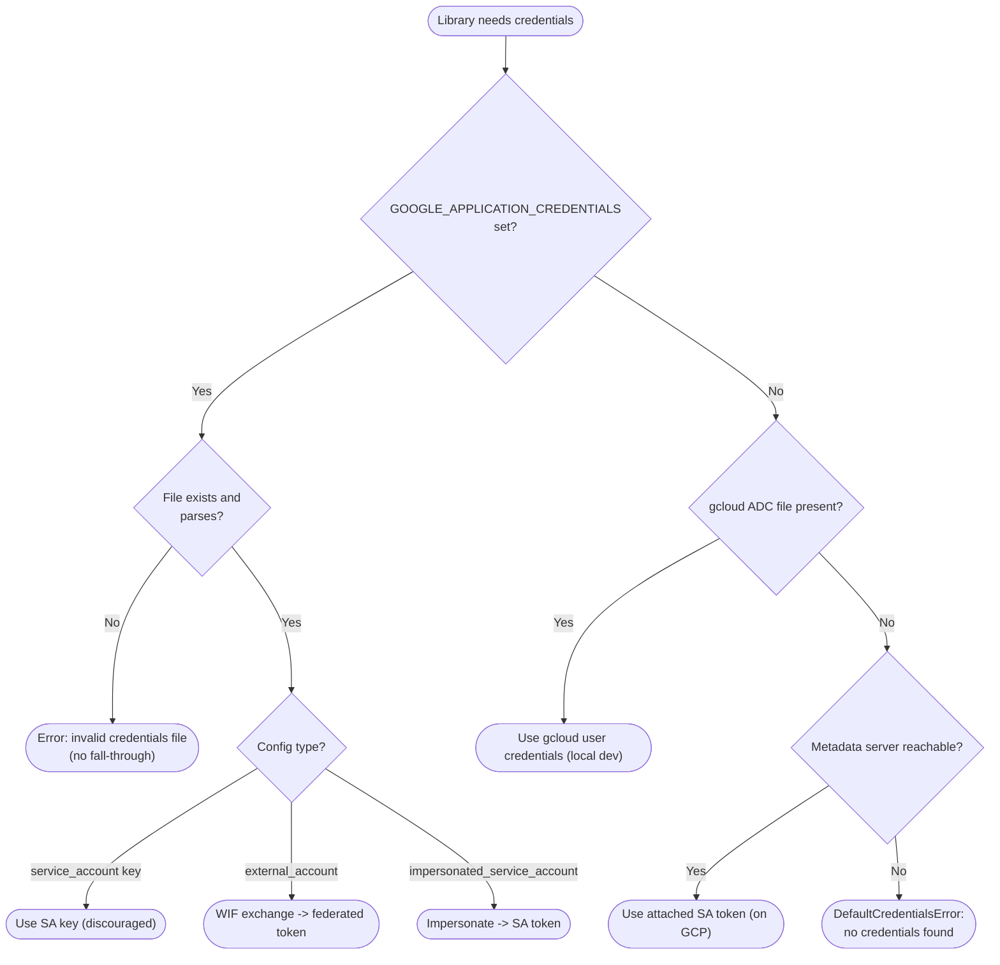

# Application Default Credentials — Decision Flowchart

The ordered source-selection logic with explicit error terminals.

Notes

- The three env-var config types all resolve through the same env-var branch; only `external_account`
  and `impersonated_service_account` are keyless and preferred.
- The chain is short-circuit: the first branch that produces a credential ends the search, so
  ordering (env → gcloud → metadata) determines which identity the app runs as.
- A set-but-broken env var (`E1`) never falls through to gcloud or metadata, preventing silent
  identity substitution.
