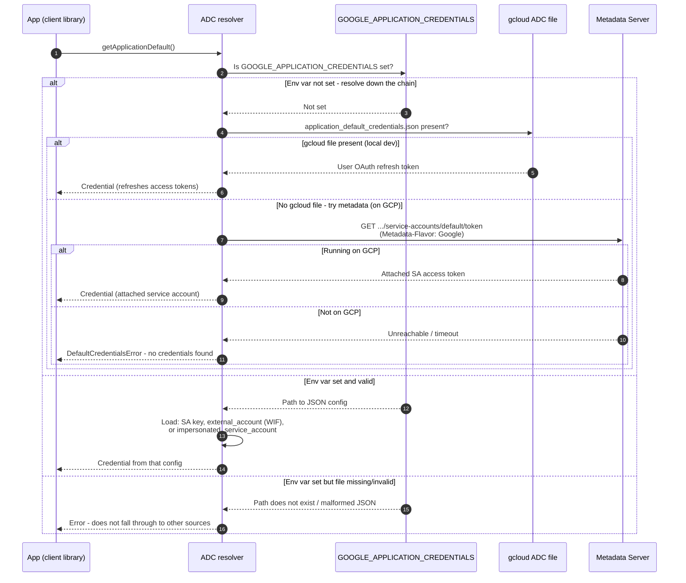

# Application Default Credentials — Sequence Diagram

Happy path first (metadata server on GCP), then alternates: env-var config, invalid env-var
file, gcloud local credentials, and no credentials found.

Notes

- Resolution is strictly ordered: env var, then gcloud user credentials, then the metadata
  server; the first source that yields a credential wins.
- A set-but-broken env var is a hard failure by design, so the app never silently uses a
  different identity further down the chain.
- An `external_account` config makes ADC perform the keyless
  [Workload Identity Federation](../workload-identity-federation/README.md) exchange transparently.
