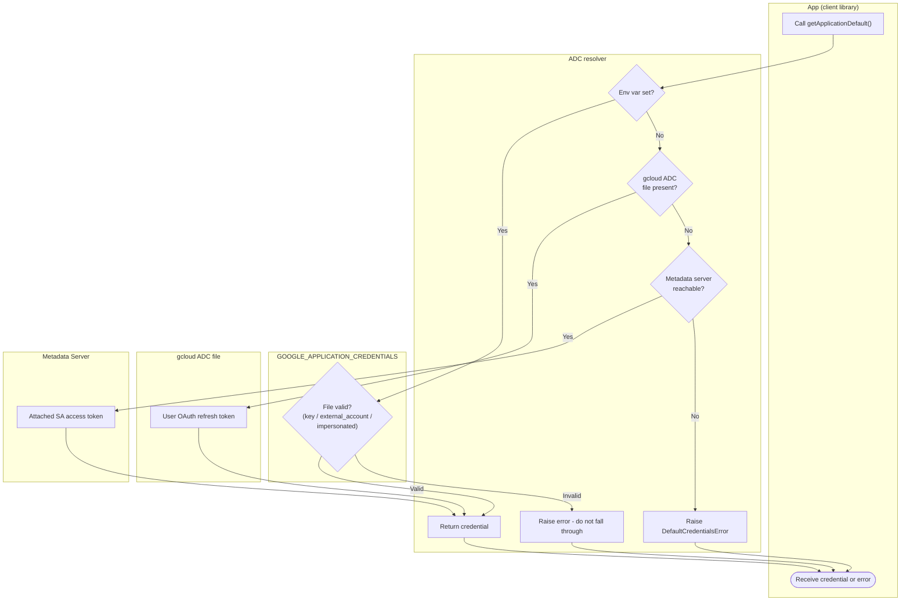

# Application Default Credentials — Swimlane Diagram

One lane per credential source. The ADC lane walks the sources in fixed order.

Notes

- The env-var lane can itself hold a keyless config (`external_account` for WIF or
  `impersonated_service_account`), not only a raw key.
- The gcloud lane is a local-dev source (user credentials); the metadata lane is the
  production-on-GCP source.
- Only a set-but-invalid env var routes to `D6`; an unset env var simply advances to the next
  source.
