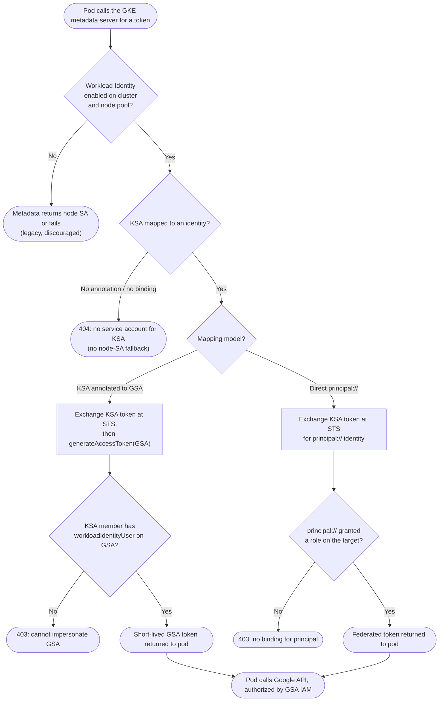

# GKE Workload Identity — Decision Flowchart

Annotation, binding, and token-exchange decisions with explicit failure terminals.

Notes

- With Workload Identity enabled, an unmapped KSA fails closed at `E2`; the node's service
  account is deliberately not offered to pods.
- The GSA model requires the `workloadIdentityUser` grant; the direct model instead needs a role
  on the `principal://` identity — see [IAM Policy Evaluation](../iam-policy-evaluation/README.md).
- All success paths yield short-lived tokens, never a mounted key file.
