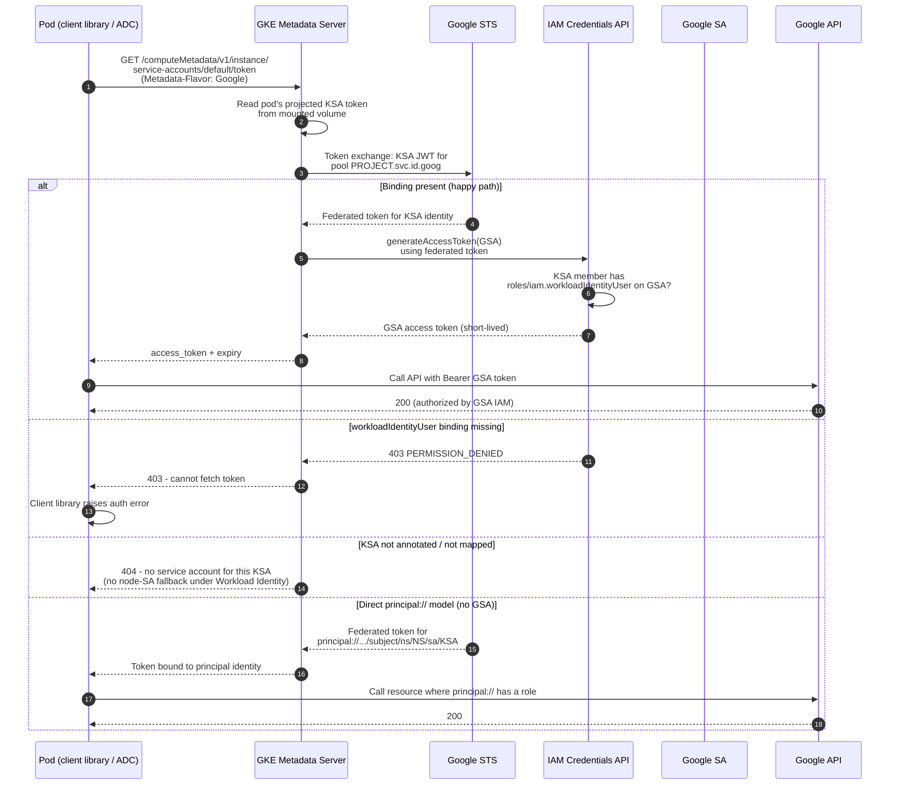

# GKE Workload Identity — Sequence Diagram

Happy path first (pod obtains a GSA token via the metadata server), then alternates: missing
`workloadIdentityUser` binding, unannotated KSA, and the direct `principal://` model.

Notes

- The pod never sees a key; it makes an ordinary metadata request and the metadata server does
  the STS + IAM Credentials work on its behalf.
- Under Workload Identity, the node's own service account is not exposed to pods, so a missing
  mapping fails closed rather than silently using the node SA.
- The projected KSA token is audience-scoped to the fleet pool and rotated by the kubelet, so the
  credential material the metadata server exchanges is always short-lived.
