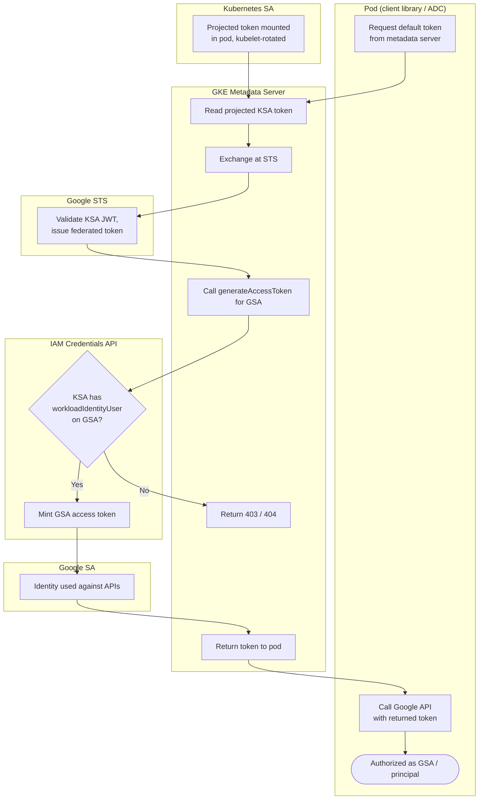

# GKE Workload Identity — Swimlane Diagram

One lane per actor. The Metadata lane hides the STS + IAM Credentials work from the pod.

Notes

- The pod's only action is a plain metadata HTTP GET; everything from `M2` onward is transparent
  to the application.
- The `workloadIdentityUser` binding at `I1` is the pivotal grant — without it the flow fails at
  the metadata server.
- In the direct `principal://` model the GSA lane collapses: the federated token from `S1` is
  returned to the pod and IAM authorizes the `principal://` identity itself.
