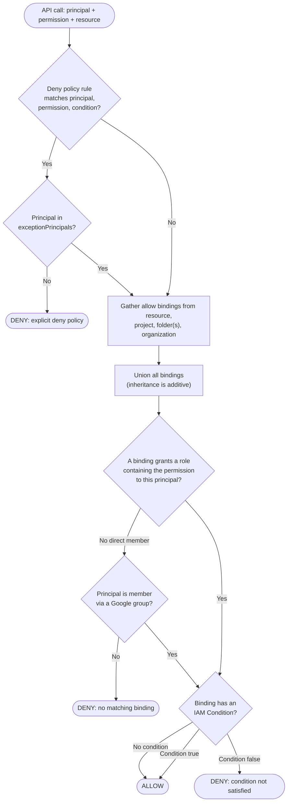

# IAM Allow-Policy Evaluation — Decision Flowchart

Deny-then-allow logic with inheritance and conditions. Every deny path terminates explicitly.

Notes

- The deny gate runs before any allow logic; only an `exceptionPrincipals` entry lets a matched
  principal continue to allow evaluation.
- There is no precedence between hierarchy levels for allows — a single matching binding at org,
  folder, project, or resource is sufficient, which is why `Union` precedes `Match`.
- A binding whose CEL condition is false is treated as absent; if it was the only match, the
  result is DENY.
