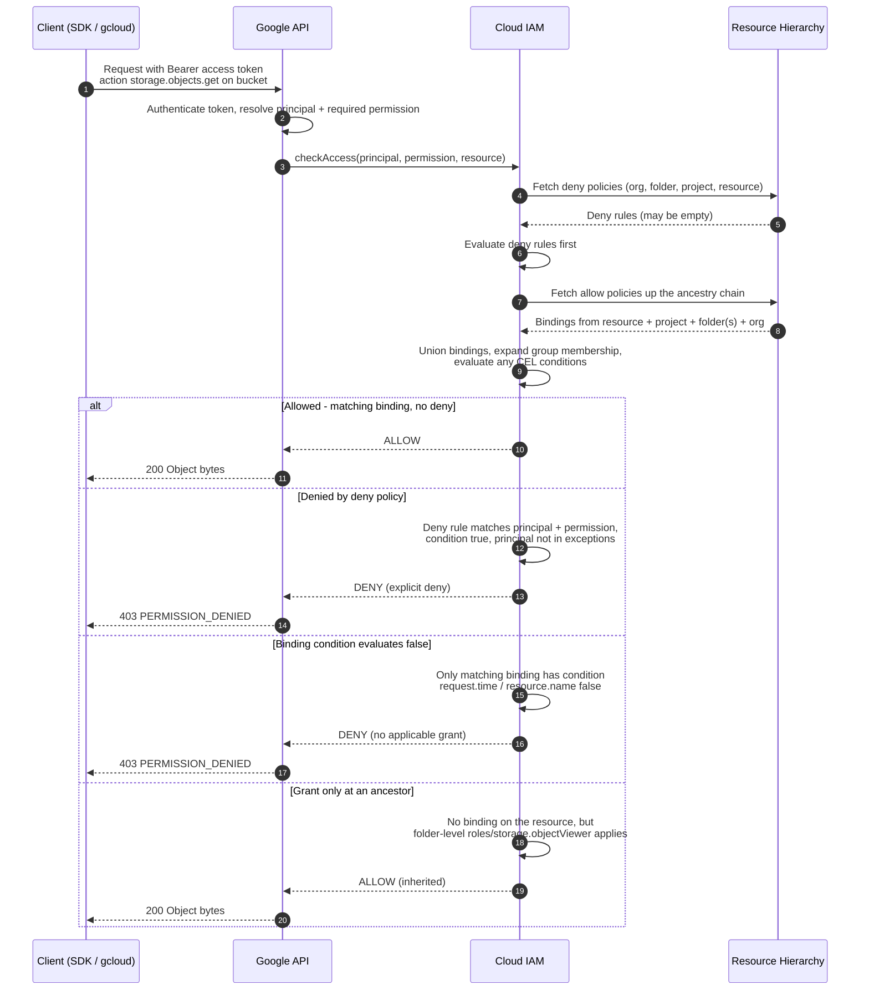

# IAM Allow-Policy Evaluation — Sequence Diagram

Happy path first (permission inherited and allowed), then alternates: deny policy override,
a false IAM Condition, and grant present only at an ancestor.

Notes

- Deny evaluation always precedes allow evaluation; a single matching deny rule short-circuits
  to DENY unless the principal is listed in that rule's `exceptionPrincipals`.
- Allow decisions are a union across the whole ancestry chain — there is no "closest policy
  wins"; any matching binding at any level grants access.
- Group membership is expanded transitively, so a principal can match a binding via a nested
  Google group.
