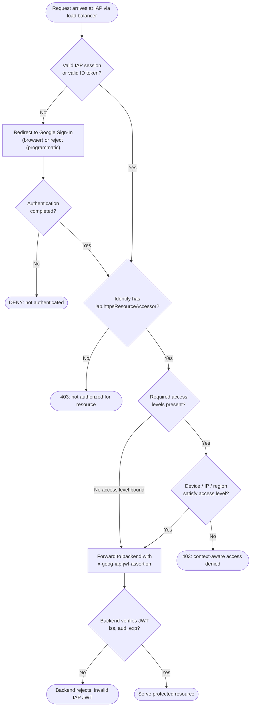

# Identity-Aware Proxy — Decision Flowchart

The authentication, IAM, access-level, and backend-verification gates. Every denial terminates
explicitly.

Notes

- The gates are ordered authentication → authorization → context; a failure at any gate returns
  403 from IAP and the backend is never contacted.
- Access levels are optional per resource; when bound via IAM Conditions they become mandatory
  and encode device posture, IP CIDR, and region.
- Backend verification is the last line of defense and assumes the app is reachable only through
  IAP — a directly reachable backend would bypass all upstream gates.
