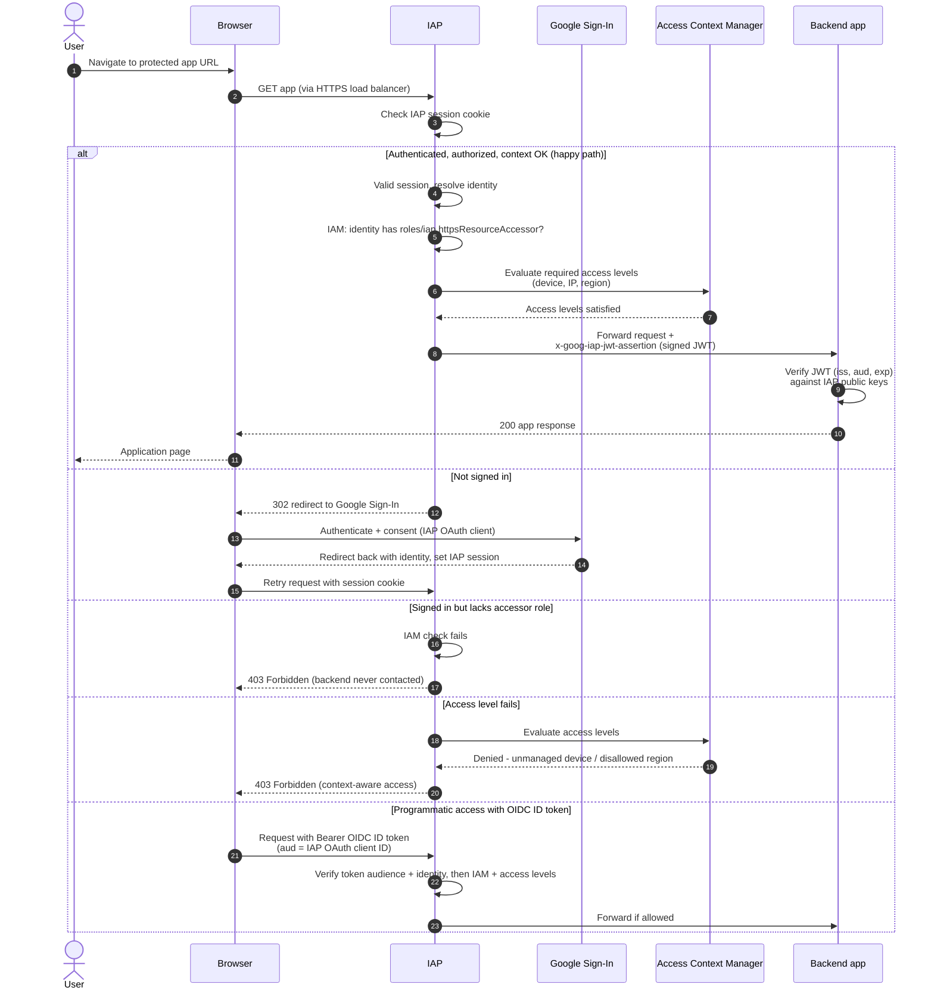

# Identity-Aware Proxy — Sequence Diagram

Happy path first (authenticated, authorized, access level passes), then alternates: not signed
in, missing accessor role, failing access level, and programmatic ID-token access.

Notes

- IAP enforces both authentication and authorization before the backend is ever reached; a
  failed check returns 403 from IAP itself.
- The backend must independently verify `x-goog-iap-jwt-assertion`; it must not trust the header
  blindly and must be unreachable except through IAP.
- Programmatic clients skip the browser cookie by presenting an OIDC ID token whose `aud` is the
  IAP OAuth client ID, often obtained via
  [service account impersonation](../service-account-impersonation/README.md) `generateIdToken`.
