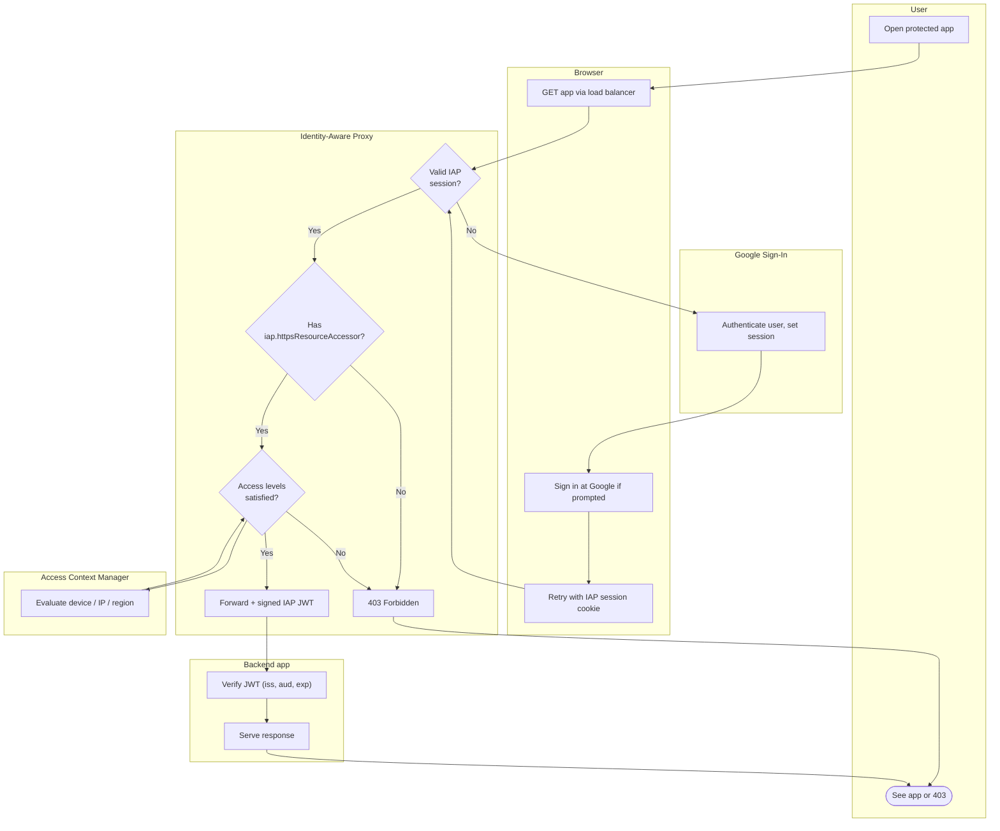

# Identity-Aware Proxy — Swimlane Diagram

One lane per actor. The IAP lane gates every request before the Backend lane is reached.

Notes

- All three gates (`P1` auth, `P2` IAM role, `P3` access level) live in the IAP lane; only after
  all pass does traffic cross into the Backend lane.
- The Backend still verifies the signed JWT at `K1`, so trust is not assumed from network position.
- A `P3` denial is context-aware access at work — identity alone is insufficient without a
  satisfying device/location posture.
