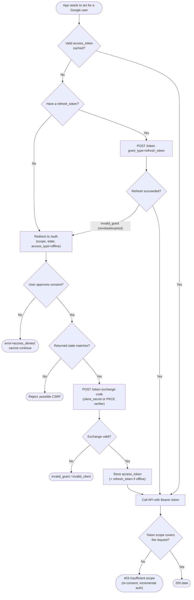

# 3-Legged OAuth to Google APIs — Decision Flowchart

Consent, offline-token, and refresh decision logic with explicit error terminals.

Notes

- The refresh branch is tried before any user interaction; only `invalid_grant` forces a full
  re-authorization.
- A refresh token is stored only when `access_type=offline` was used and consent was granted the
  first time.
- Insufficient scope is resolved by incremental authorization (`include_granted_scopes=true`)
  rather than discarding existing grants.
