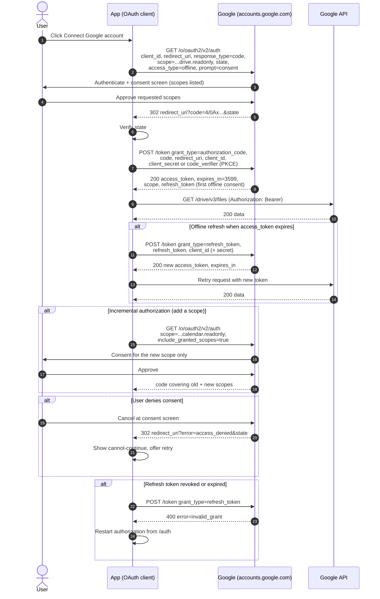

# 3-Legged OAuth to Google APIs — Sequence Diagram

Happy path first (consent, code exchange, API call), then alternates: offline refresh,
incremental authorization, and a user denying consent.

Notes

- `access_type=offline` plus first-time consent is what yields a `refresh_token`, subsequent
  consents omit it unless `prompt=consent` forces a new one.
- `include_granted_scopes=true` merges new scopes with already-granted ones so one token covers
  both.
- Public clients use PKCE (`code_verifier`) and send no client secret, confidential clients keep
  the secret server-side.
