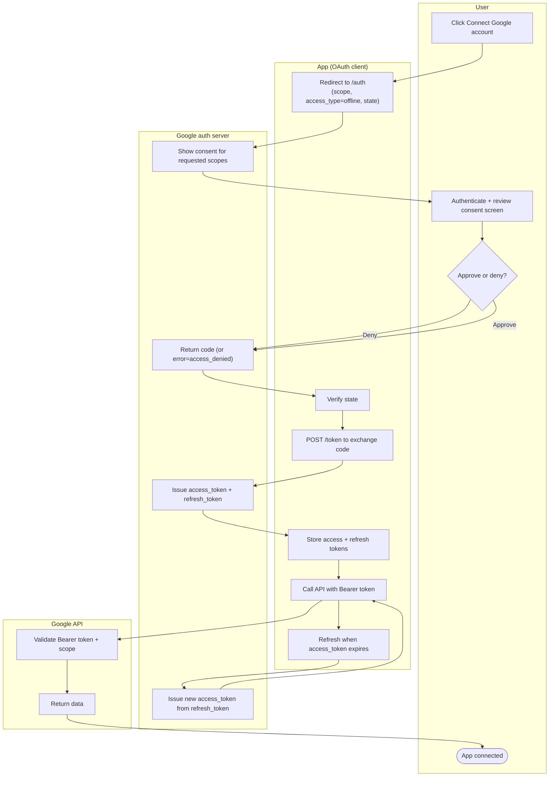

# 3-Legged OAuth to Google APIs — Swimlane Diagram

One lane per actor. Front-channel handoffs pass through the User; the code exchange and refresh
are back-channel App-to-Google calls.

Notes

- The consent screen (`G1`) and its scope list live in the Google lane; the User only approves or
  denies (`U3`).
- The refresh loop (`A6 --> G4 --> A5`) stays entirely in the App/Google back channel, no user
  interaction.
- A denial routes through `G2` with `error=access_denied` and never reaches the token exchange.
