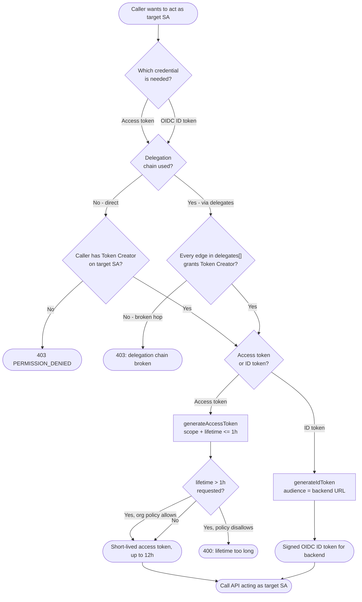

# Service Account Impersonation — Decision Flowchart

Token Creator checks, delegation, and token-type selection with explicit error terminals.

Notes

- The Token Creator check is per-edge: direct impersonation checks one edge, a delegation chain
  ANDs every hop, and any missing grant terminates the flow.
- Access-token lifetimes above one hour require the
  `iam.allowServiceAccountCredentialLifetimeExtension` org constraint; otherwise the request is
  rejected.
- Regardless of type, the resulting call is authorized against the target SA's IAM policy — see
  [IAM Policy Evaluation](../iam-policy-evaluation/README.md).
