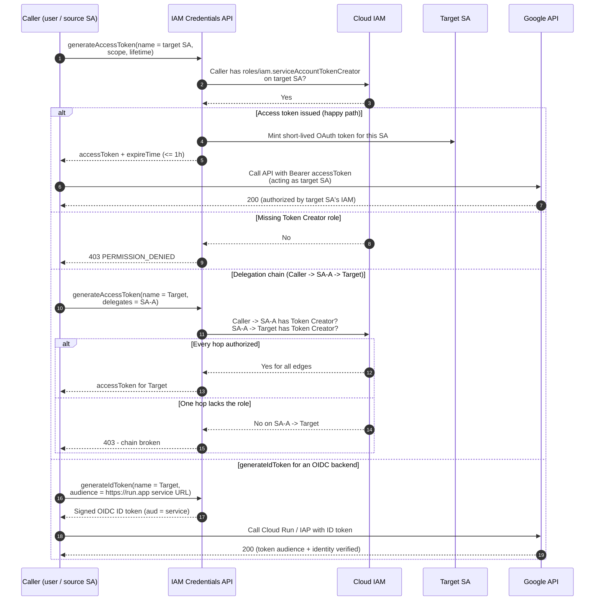

# Service Account Impersonation — Sequence Diagram

Happy path first (`generateAccessToken` with the Token Creator role), then alternates:
missing role, a delegation chain, and `generateIdToken` for an OIDC backend.

Notes

- The Bearer token in the happy path is the target SA's; the API authorizes against the target
  SA's IAM bindings, not the caller's.
- In a delegation chain, every edge (caller → first delegate, delegate → delegate, last delegate
  → target) must independently grant Token Creator; a single missing edge fails the whole call.
- `generateIdToken` produces an OIDC token whose `aud` claim the backend validates — used for
  Cloud Run service-to-service and IAP-protected resources.
