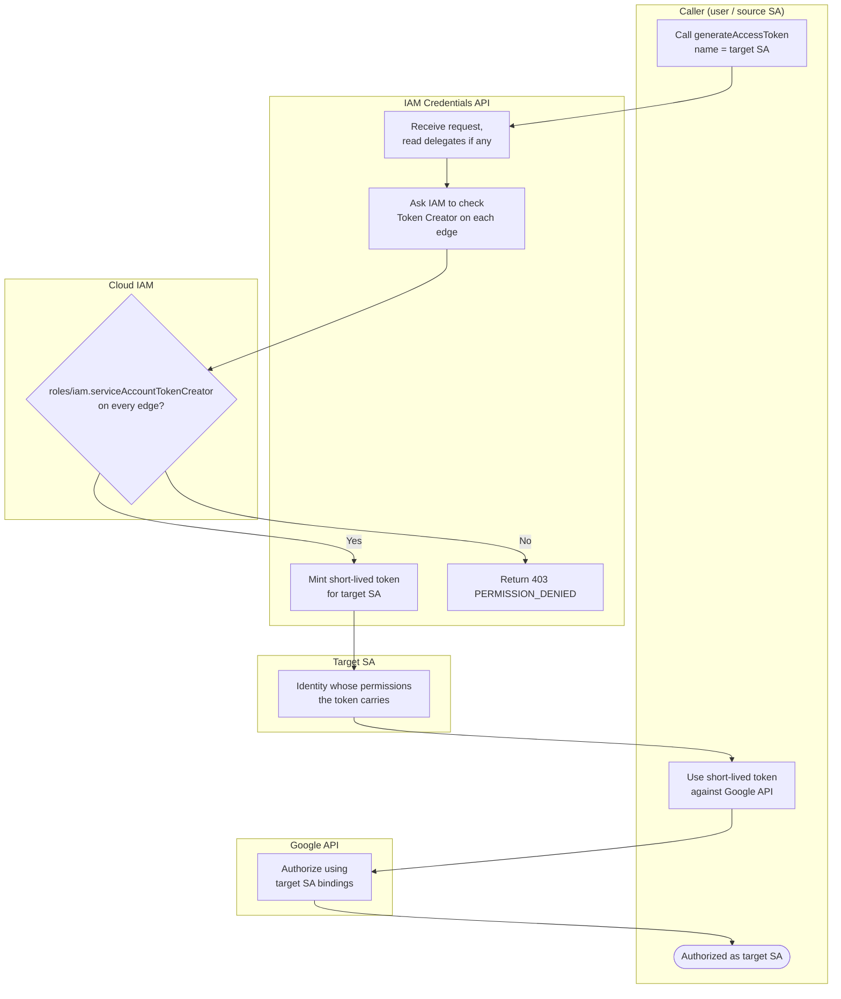

# Service Account Impersonation — Swimlane Diagram

One lane per actor. The delegation branch shows an intermediate SA hop.

Notes

- The token minted at `K3` carries `TargetSA`'s identity, so `A1` authorizes against the target
  SA's IAM policy, not the caller's.
- For a delegation chain, `M1` represents the AND of every hop's Token Creator check; any single
  failure routes to `K4`.
- A downloadable JSON key would bypass this entire flow with a long-lived secret — see the
  deprecated-practice note in the [README](README.md).
