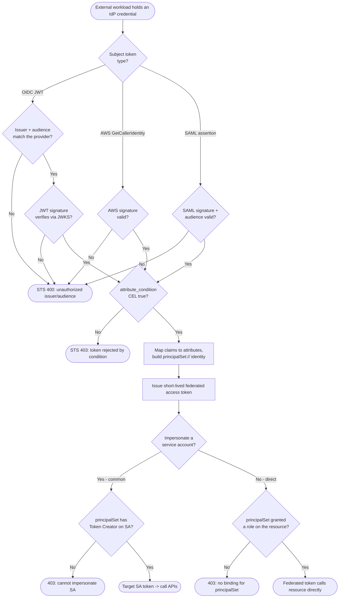

# Workload Identity Federation — Decision Flowchart

Provider validation, attribute mapping, and the federate-then-impersonate decision. Rejections
terminate explicitly.

Notes

- All three subject-token types converge on the same `attribute_condition` gate; the condition is
  the primary defense that stops an over-broad issuer from federating arbitrary workloads.
- The `principalSet://` identity produced by attribute mapping is what IAM bindings reference, both
  for Token Creator (impersonation) and for direct resource grants.
- Every success terminal yields only short-lived credentials — no key material persists.
