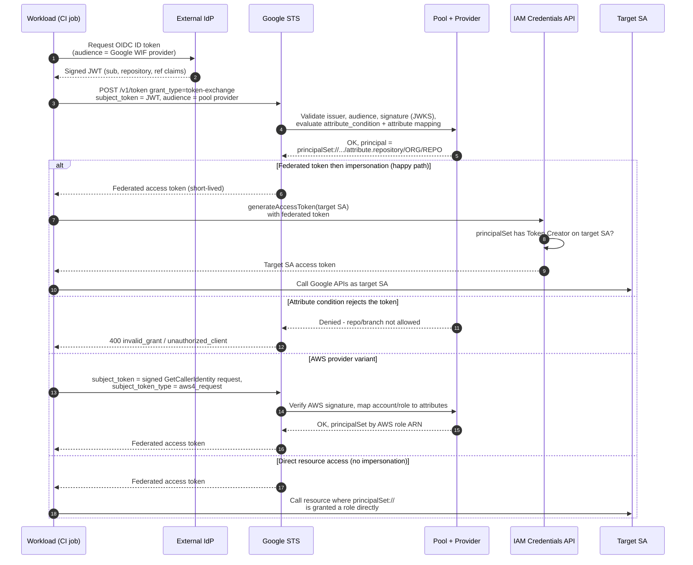

# Workload Identity Federation — Sequence Diagram

Happy path first (GitHub Actions OIDC token exchanged then SA impersonation), then alternates:
attribute-condition rejection, AWS subject token, and direct resource access without impersonation.

Notes

- The audience the external IdP mints into the token must equal the WIF provider's expected
  audience; a mismatch fails validation at the Pool.
- The two-leg pattern (federate → impersonate) is most common because many APIs and quota still
  key on a service account identity; direct `principalSet://` grants skip the second leg.
- No downloadable key is ever involved — the only long-lived trust is the provider's issuer +
  attribute-condition configuration.
