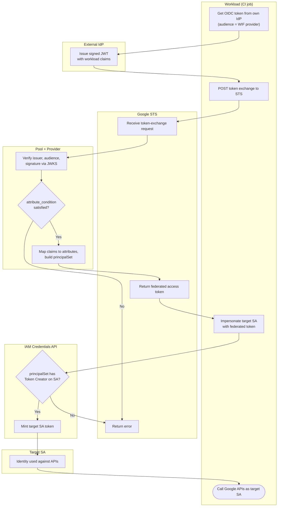

# Workload Identity Federation — Swimlane Diagram

One lane per actor. The Pool lane performs issuer/audience/condition validation and mapping.

Notes

- The Pool lane is the trust boundary: issuer, audience, signature, and `attribute_condition`
  must all pass before any Google credential is minted.
- The federated token from `S2` is not itself the final credential in the common pattern — it is
  spent at `K1`/`K2` to impersonate the target SA.
- A direct-access configuration would bind the `principalSet://` to a resource role and skip the
  IAMCreds lane entirely.
