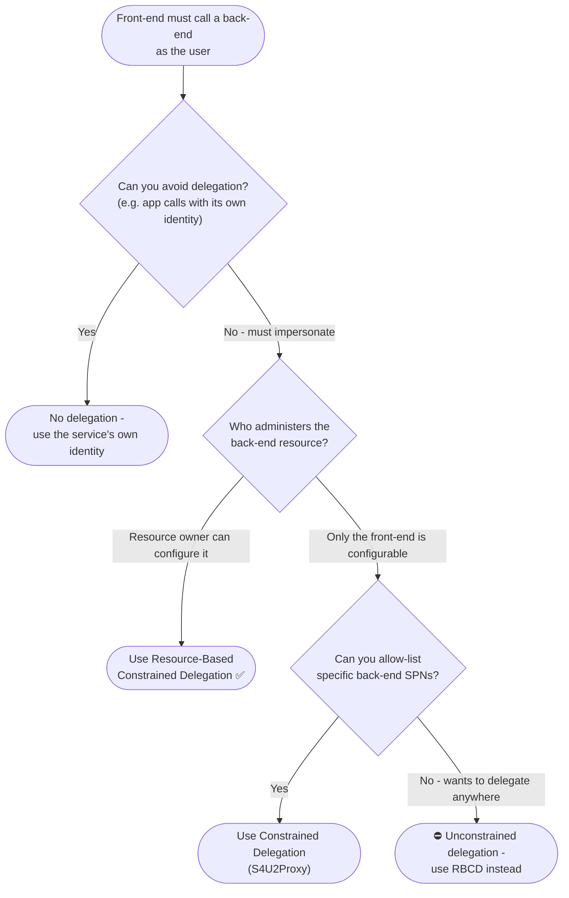

# Choosing a Kerberos Delegation Model — Decision Tree

Leaves name the recommended model. Unconstrained delegation is ⛔ with its replacement.

Leaf links

- **Use Resource-Based Constrained Delegation** → [`../../kerberos/resource-based-constrained-delegation/`](../../kerberos/resource-based-constrained-delegation/README.md)
- **Use Constrained Delegation (S4U2Proxy)** → [`../../kerberos/constrained-delegation/`](../../kerberos/constrained-delegation/README.md)
- **No delegation** → [`../../kerberos/tgs-exchange/`](../../kerberos/tgs-exchange/README.md) (standard service ticket, no impersonation)
- **⛔ Unconstrained delegation** → replacement [`../../kerberos/resource-based-constrained-delegation/`](../../kerberos/resource-based-constrained-delegation/README.md) (reference: [`../../kerberos/unconstrained-delegation/`](../../kerberos/unconstrained-delegation/README.md))
