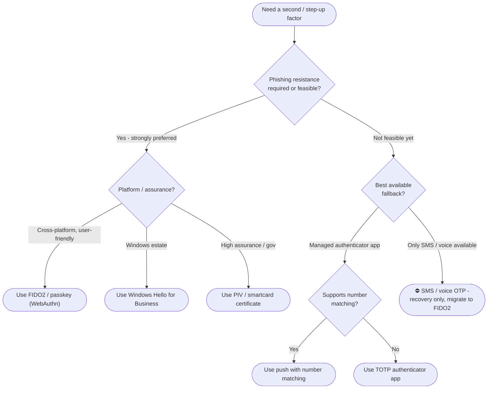

# Choosing an MFA Factor — Decision Tree

Leaves name the recommended factor. Phishing-resistant options are preferred; SMS/voice is ⛔.

Leaf links

- **Use FIDO2 / passkey (WebAuthn)** → [`../../tokenless/webauthn-passkey-authentication/`](../../tokenless/webauthn-passkey-authentication/README.md)
- **Use Windows Hello for Business** → [`../../cloud-iam/entra/windows-hello-for-business/`](../../cloud-iam/entra/windows-hello-for-business/README.md)
- **Use PIV / smartcard certificate** → [`../../kerberos/pkinit/`](../../kerberos/pkinit/README.md)
- **Use push with number matching** → [`../../platform-specific/okta-fastpass-passwordless/`](../../platform-specific/okta-fastpass-passwordless/README.md)
- **Use TOTP authenticator app** → [`../../tokenless/webauthn-passkey-authentication/`](../../tokenless/webauthn-passkey-authentication/README.md) (passwordless upgrade path)
- **⛔ SMS / voice OTP** → replacement [`../../tokenless/webauthn-passkey-authentication/`](../../tokenless/webauthn-passkey-authentication/README.md)
