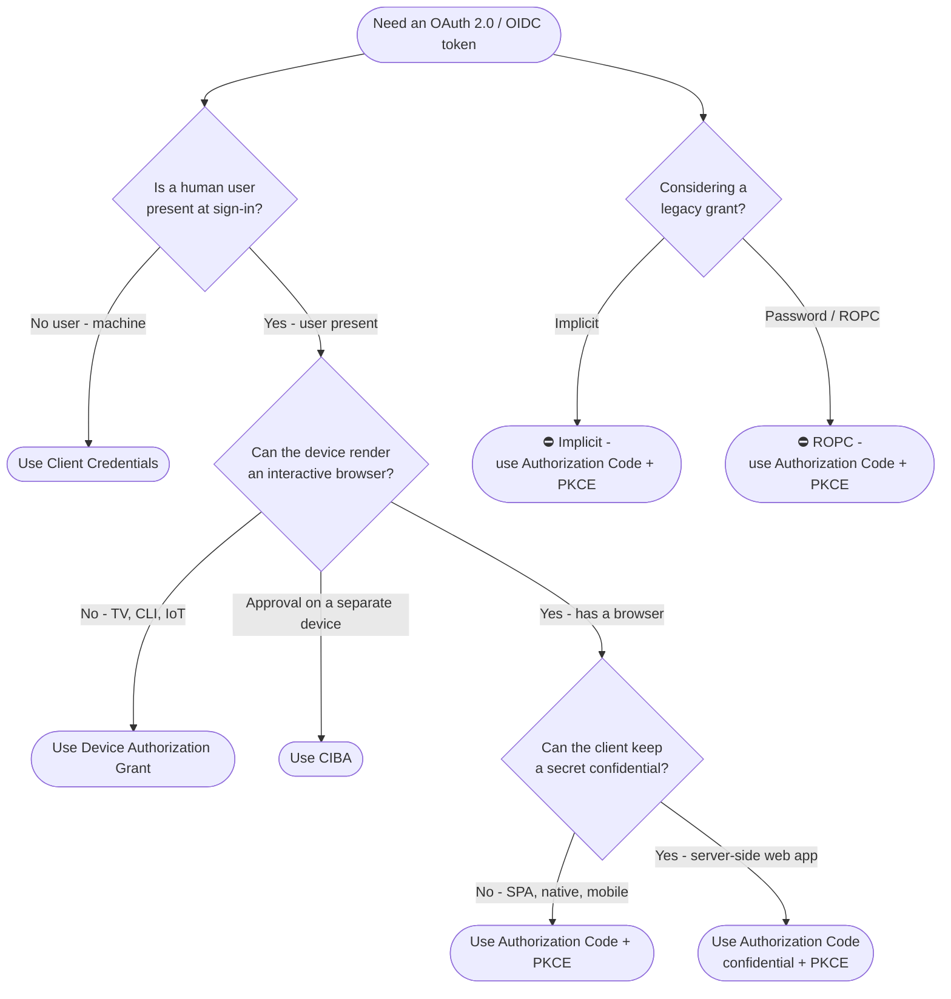

# Choosing an OAuth 2.0 Grant — Decision Tree

Leaves name the recommended grant; deprecated grants are ⛔ with their replacement.

Leaf links

- **Use Authorization Code + PKCE** → [`../../oidc/authorization-code-pkce/`](../../oidc/authorization-code-pkce/README.md)
- **Use Authorization Code confidential + PKCE** → [`../../oidc/authorization-code/`](../../oidc/authorization-code/README.md)
- **Use Client Credentials** → [`../../oidc/client-credentials/`](../../oidc/client-credentials/README.md)
- **Use Device Authorization Grant** → [`../../oidc/device-authorization/`](../../oidc/device-authorization/README.md)
- **Use CIBA** → [`../../oidc/ciba/`](../../oidc/ciba/README.md)
- **⛔ Implicit** → replacement [`../../oidc/authorization-code-pkce/`](../../oidc/authorization-code-pkce/README.md) (reference: [`../../oidc/implicit/`](../../oidc/implicit/README.md))
- **⛔ ROPC** → replacement [`../../oidc/authorization-code-pkce/`](../../oidc/authorization-code-pkce/README.md)
