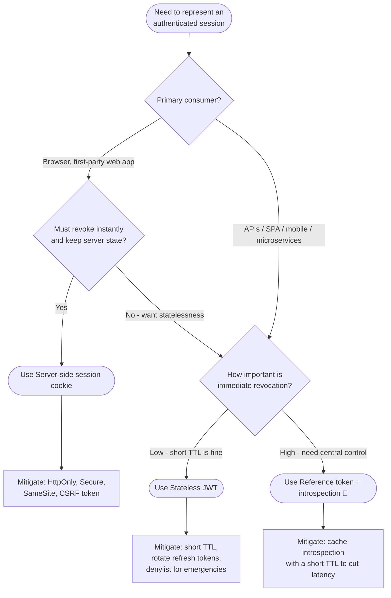

# Choosing Session vs Token — Decision Tree

Leaves name the recommended session representation.

Leaf links

- **Use Server-side session cookie** → [`../../tokenless/session-cookie/`](../../tokenless/session-cookie/README.md)
- **Use Stateless JWT** → [`../../oidc/authorization-code-pkce/`](../../oidc/authorization-code-pkce/README.md) (JWT access/ID tokens)
- **Use Reference token + introspection** → [`../../oidc/authorization-code/`](../../oidc/authorization-code/README.md) (confidential client issues/holds the opaque token)
