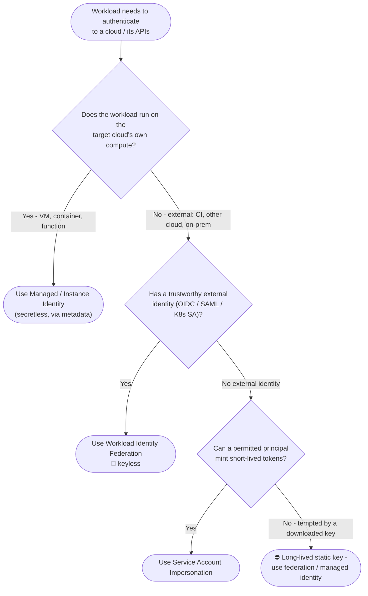

# Choosing Workload Cloud Authentication — Decision Tree

Leaves name the recommended mechanism. Long-lived static keys are ⛔ with their replacement.

Leaf links

- **Use Managed / Instance Identity** → [`../../workload-identity/secretless-instance-identity/`](../../workload-identity/secretless-instance-identity/README.md) (e.g. Entra managed identity via IMDS *(planned)*)
- **Use Workload Identity Federation** → [`../../workload-identity/workload-identity-federation-generic/`](../../workload-identity/workload-identity-federation-generic/README.md) (e.g. [AWS AssumeRole with Web Identity](../../cloud-iam/aws/assumerole-web-identity-oidc/README.md), [CI/CD OIDC-to-cloud](../../cicd/oidc-to-cloud-federation/README.md))
- **Use Service Account Impersonation** → [`../../cloud-iam/gcp/service-account-impersonation/`](../../cloud-iam/gcp/service-account-impersonation/README.md)
- **⛔ Long-lived static key** → replacement [`../../workload-identity/workload-identity-federation-generic/`](../../workload-identity/workload-identity-federation-generic/README.md) (reference: [key lifecycle](../../workload-identity/service-account-key-lifecycle/README.md))
