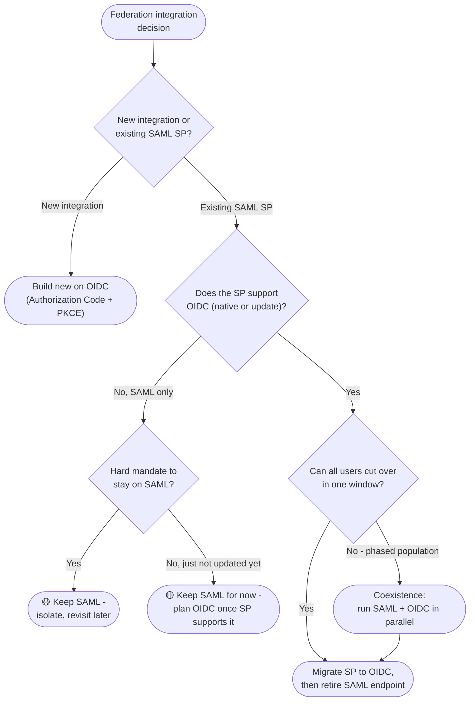

# SAML-to-OIDC Migration — Decision Tree

Leaves name the recommended path; SAML is 🟡 legacy with OIDC as the target.

Leaf links

- **Build new on OIDC** → [`../../oidc/authorization-code-pkce/`](../../oidc/authorization-code-pkce/README.md)
- **Migrate SP to OIDC** → [`../../oidc/authorization-code-pkce/`](../../oidc/authorization-code-pkce/README.md) (server-side web app: [`../../oidc/authorization-code/`](../../oidc/authorization-code/README.md))
- **Coexistence (SAML + OIDC in parallel)** → target [`../../oidc/authorization-code-pkce/`](../../oidc/authorization-code-pkce/README.md), source [`../../saml/sp-initiated-sso/`](../../saml/sp-initiated-sso/README.md)
- **🟡 Keep SAML** → [`../../saml/sp-initiated-sso/`](../../saml/sp-initiated-sso/README.md); replacement when unblocked [`../../oidc/authorization-code-pkce/`](../../oidc/authorization-code-pkce/README.md)
