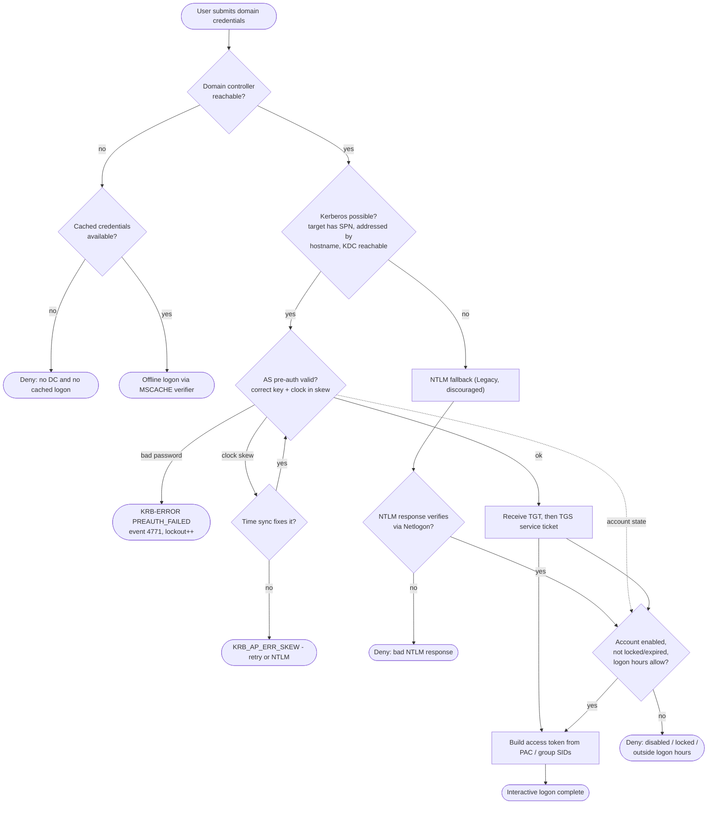

# Active Directory Interactive Logon — Decision Flowchart

Logon-stack decision logic: choose Kerberos, fall back to NTLM (Legacy), or cached logon,
with explicit error terminals.

Notes

- The first fork is availability: no DC forces the cached-logon path, which never contacts the
  directory and grants the last-known token if a verifier exists.
- The Kerberos-vs-NTLM fork turns on whether a ticket can be obtained (SPN present, hostname
  addressing, KDC reachable). NTLM is only the fallback and is marked Legacy/discouraged.
- Account-state checks (disabled, locked, logon hours) apply regardless of mechanism before the
  token is built.
