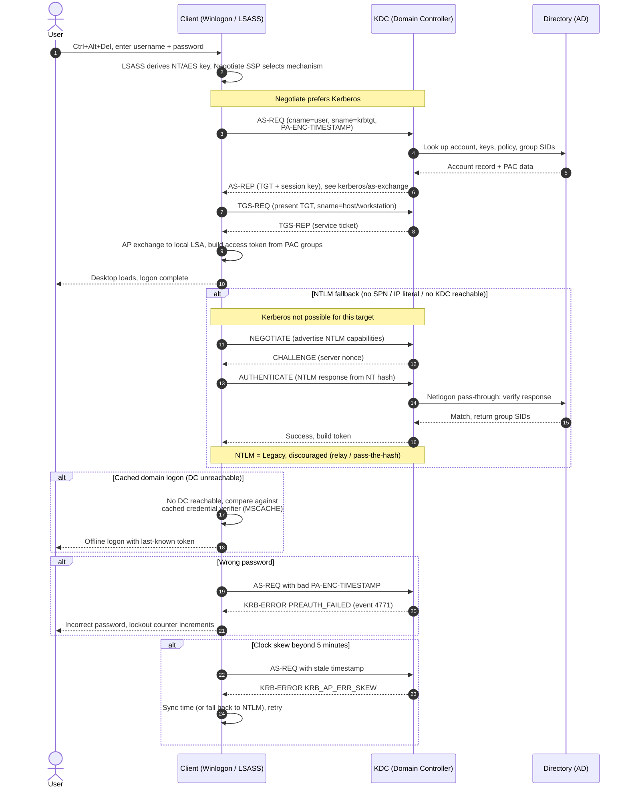

# Active Directory Interactive Logon — Sequence Diagram

Happy path first (Kerberos AS/TGS/AP via Negotiate), then NTLM fallback, cached domain
logon, wrong password, and clock skew.

Notes

- The happy path is Kerberos: AS-REQ/AS-REP for the TGT, TGS-REQ/TGS-REP for the
  `host/workstation` service ticket, then a local AP exchange to build the token from the PAC.
- NTLM fallback is a challenge/response verified by the DC over the Netlogon secure channel;
  it produces no ticket and is flagged here as Legacy.
- Cached (MSCACHE) logon lets a user in when no DC is reachable, using a stored verifier rather
  than live authentication.
