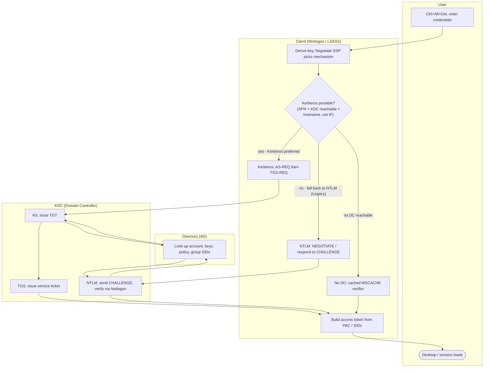

# Active Directory Interactive Logon — Swimlane Diagram

One lane per actor. The Negotiate SSP in the Client lane decides Kerberos vs NTLM.

Notes

- The `C2` decision is the whole story: Kerberos is preferred and used whenever a target SPN
  and a reachable KDC (by hostname) exist; otherwise the Client falls back to NTLM (Legacy) or,
  with no DC at all, to a cached verifier.
- Both Kerberos and NTLM ultimately read group SIDs from the Directory; the token the Client
  builds is the same shape regardless of mechanism.
- Error branches (bad password, skew, lockout) exit from the KDC lane as KRB-ERROR / NTLM
  failure — see [flowchart.md](flowchart.md).
