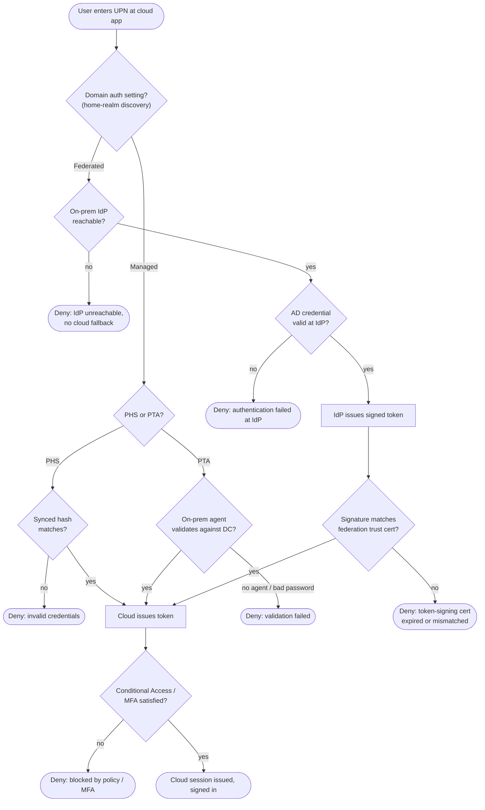

# Federated vs Managed Authentication — Decision Flowchart

The per-domain routing decision and each path's validation gates, with explicit error
terminals for the federated failure modes.

Notes

- The first fork is configuration, not credentials: the domain's Managed-vs-Federated
  setting decides whether the credential is ever checked in the cloud at all.
- The federated path adds two failure modes managed does not have — an unreachable on-prem
  IdP and a signing-certificate mismatch — and neither has a cloud-side fallback.
- Both paths converge at `ISSUE`, after which cloud-side Conditional Access and MFA apply
  identically regardless of how the credential was verified.
