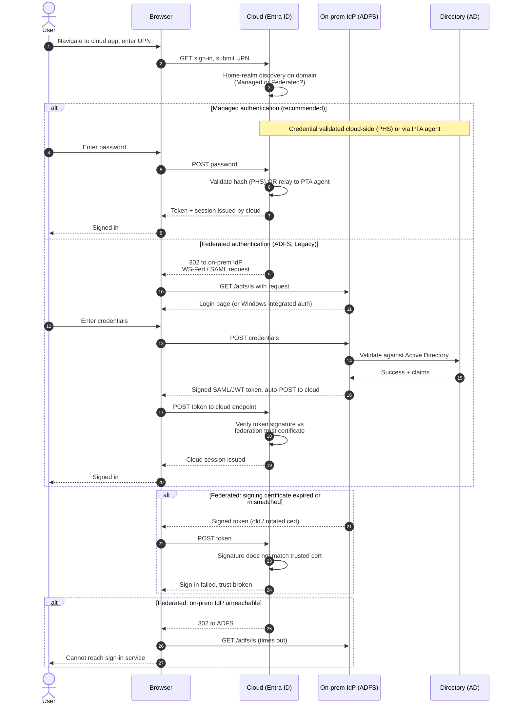

# Federated vs Managed Authentication — Sequence Diagram

Happy path first (managed cloud authentication), then the federated redirect-to-ADFS path,
plus federated failure modes: expired signing certificate and unreachable on-prem IdP.

Notes

- The branch is chosen by the domain's authentication setting during home-realm discovery,
  the same user can be managed on one domain and federated on another.
- On the managed path the cloud always mints the token, PTA only reaches on-prem for the
  password check, PHS never leaves the cloud at all.
- On the federated path the on-prem IdP mints a signed token and the cloud only verifies its
  signature, so a certificate drift or an IdP outage breaks every sign-in with no cloud fallback.
