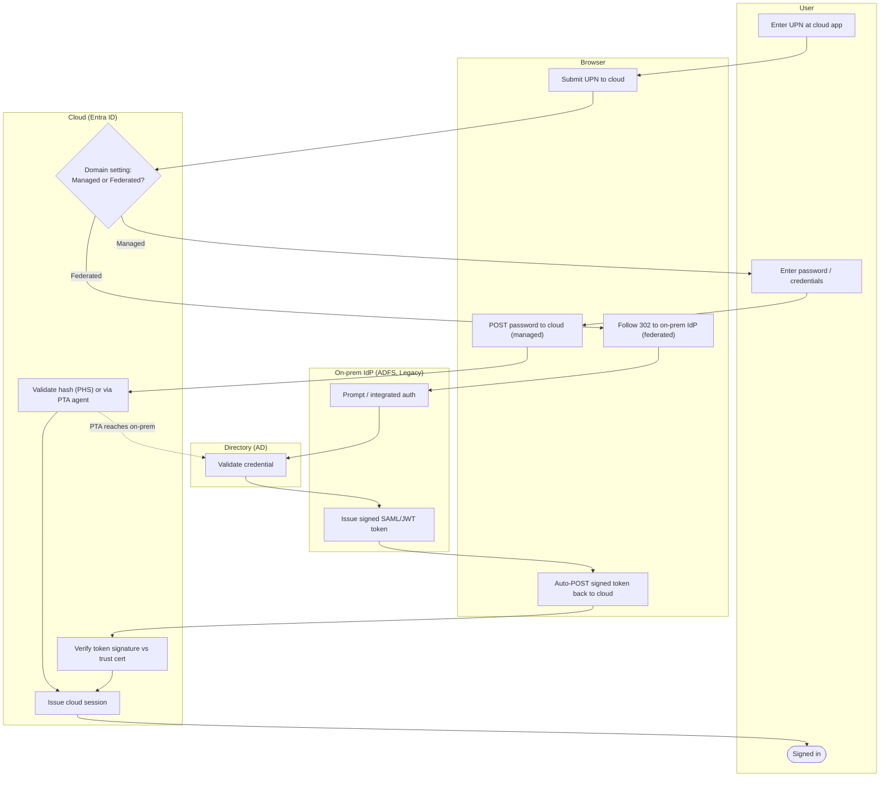

# Federated vs Managed Authentication — Swimlane Diagram

One lane per actor. The Cloud lane's routing decision sends the flow either fully cloud-side
(managed) or out to the on-prem IdP lane (federated).

Notes

- `C1` is the whole contrast: the managed branch stays in the Cloud lane (the token is
  minted there), the federated branch detours through the IdP lane which mints the token.
- Both branches ultimately consult the Directory lane, but only federation hands the on-prem
  IdP the job of issuing the token the cloud must then trust.
- Federated failure modes (bad signing cert, IdP unreachable) break the `I2 --> B4 --> C3`
  hand-back — see [flowchart.md](flowchart.md).
