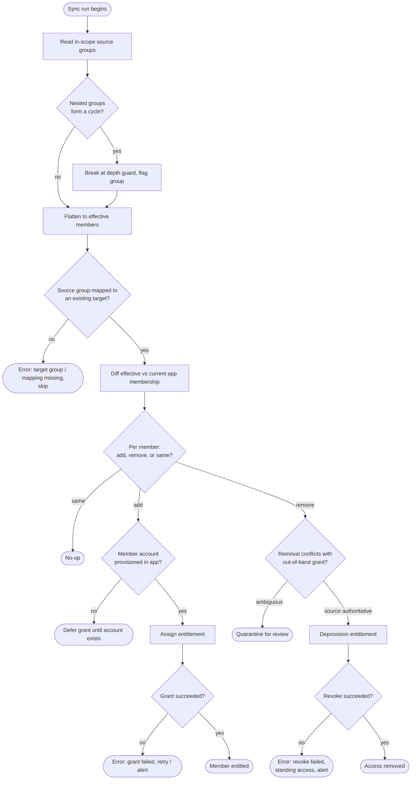

# Group Membership Sync — Decision Flowchart

Per-member decision logic from source group to downstream entitlement, with explicit error
and quarantine terminals.

Notes

- Cycle detection and the depth guard run before flattening so a circular or pathologically
  nested group cannot hang the run or explode the effective set.
- Adds are held (`DEFER`) when the member has no account yet, avoiding orphaned grants;
  removes drive a real deprovision so leaving a group actually revokes access.
- A failed revoke is escalated as standing-access risk rather than dropped, and out-of-band
  conflicts resolve to the authoritative source or quarantine when ambiguous.
