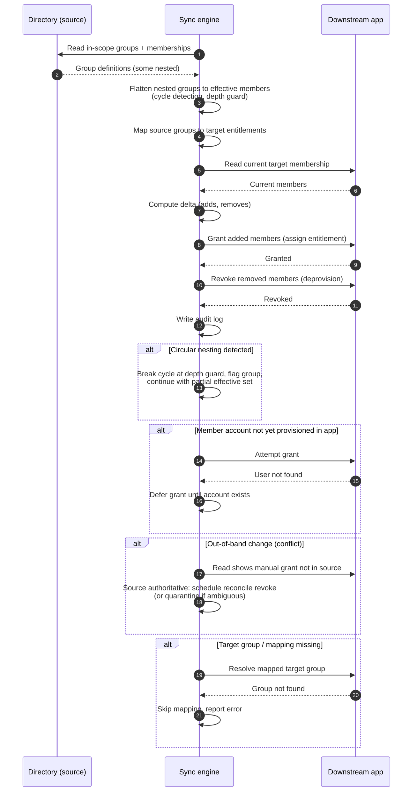

# Group Membership Sync — Sequence Diagram

Happy path first (flatten, diff, grant and revoke), then circular nesting, member not yet
provisioned, out-of-band conflict, and a missing target group.

Notes

- Flattening happens before the diff, so a user who is a member only through a child group is
  included in the effective set the app receives.
- Removes are applied as real revokes (deprovision on removal), so dropping a user from the
  source group actually strips the downstream entitlement.
- Conflicts where the target was changed out of band resolve in favor of the authoritative
  source, with genuinely ambiguous cases quarantined rather than blindly overwritten.
