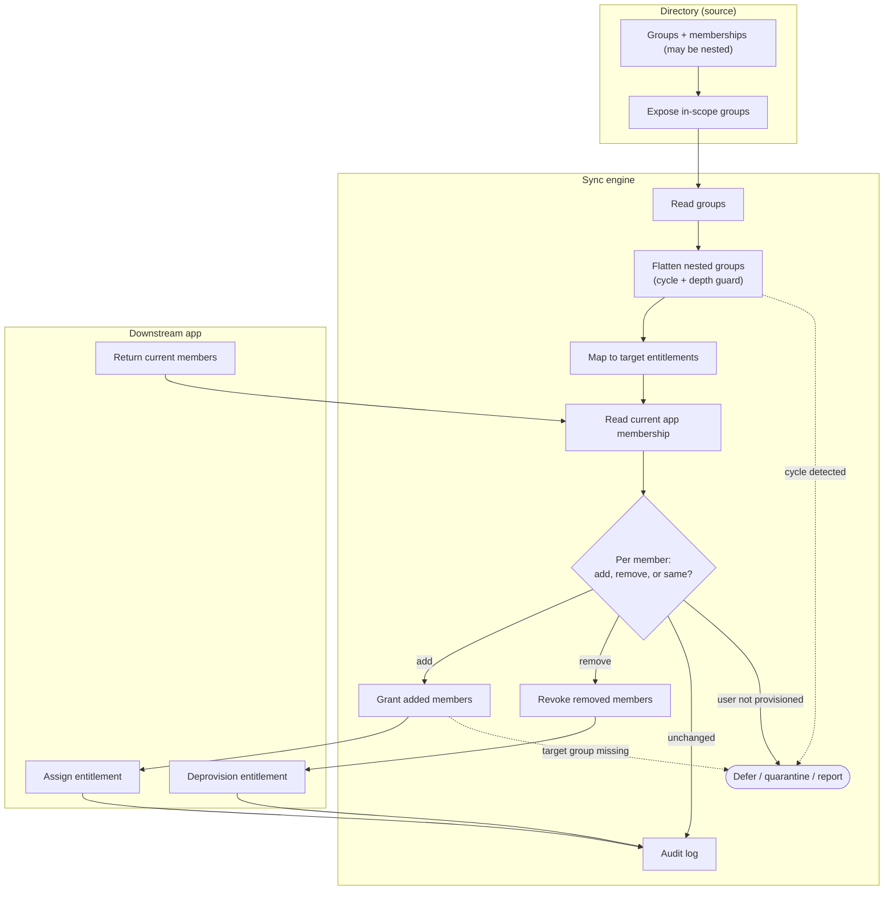

# Group Membership Sync — Swimlane Diagram

One lane per actor. The Directory lane is authoritative; the Sync lane flattens and diffs;
the App lane receives grants and revokes.

Notes

- Flattening in the Sync lane (`S2`) resolves nested membership before the `S5` diff, so the
  App lane only ever sees a flat effective member list.
- The `remove` branch drives a real deprovision (`A2`), which is the control that prevents
  stale downstream access after someone leaves a source group.
- Deferrals, conflicts, missing target groups, and cycles all divert to the `SQ` terminal
  rather than corrupting the App state — see [flowchart.md](flowchart.md).
