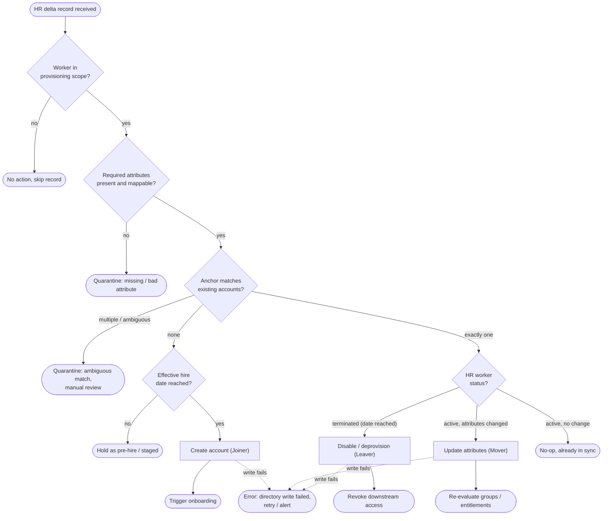

# HR-Driven Inbound Provisioning — Decision Flowchart

Per-record decision logic from HR delta to lifecycle action, with explicit quarantine and
error terminals.

Notes

- Scope and attribute validation gate every record before any match is attempted, so bad or
  irrelevant data never reaches the directory.
- A missing match is a Joiner but only fires at the effective hire date; a single match
  routes on HR status into Mover, Leaver, or no-op.
- Directory write failures are surfaced as a retry/alert terminal rather than silently
  dropped — a failed Leaver disable is standing access risk.
