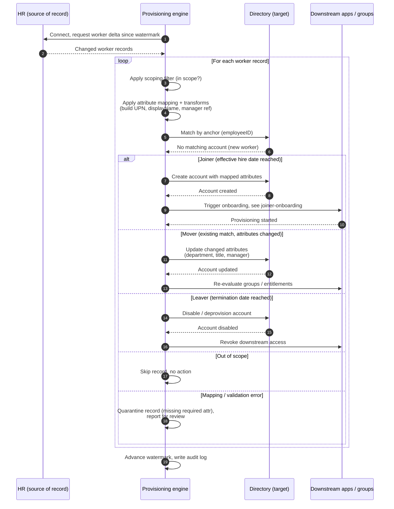

# HR-Driven Inbound Provisioning — Sequence Diagram

Happy path first (new worker becomes a created account), then Mover updates, Leaver
disable, out-of-scope skip, and quarantine on a mapping/validation error.

Notes

- The engine pulls a delta since the last watermark, so a run touches only workers whose HR
  record changed, then advances the watermark once the batch completes.
- Creation, update, and disable are timed to HR effective dates (hire, change, termination),
  not to when the sync happens to run.
- A record that cannot be mapped or matched cleanly is quarantined and reported rather than
  guessed, so one bad worker record does not corrupt or stall the rest of the batch.
