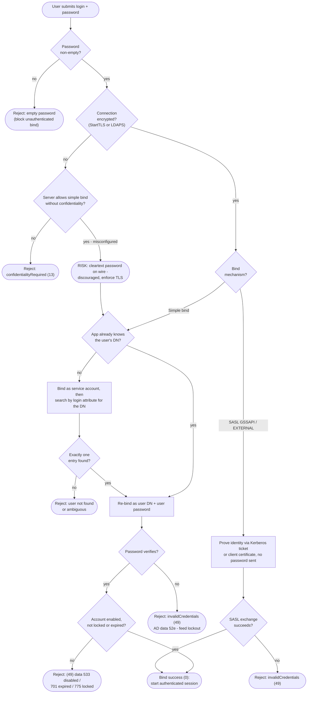

# LDAP Bind Authentication — Decision Flowchart

Client and server decision logic for a bind, with the transport-security gate first and
explicit error terminals.

Notes

- The confidentiality gate is first: a simple bind must not proceed in cleartext. A hardened
  server returns `confidentialityRequired (13)` instead of accepting the password.
- Search-then-bind adds the `SVC`/`SEARCH` detour only when the app does not already hold the
  user's DN; the credential is still only checked in the final `USERBIND`.
- SASL `EXTERNAL`/`GSSAPI` skip the password path entirely — identity comes from a certificate
  or a Kerberos ticket, so there is no `USERBIND` password to leak.
