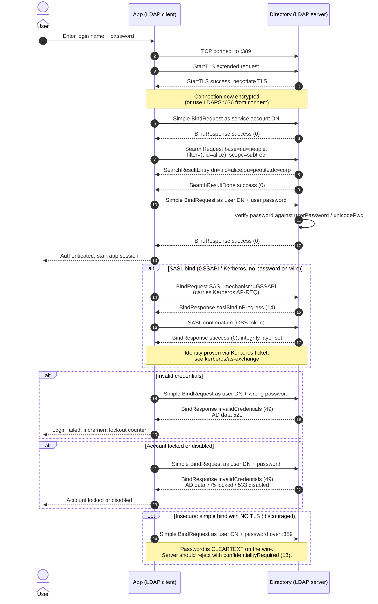

# LDAP Bind Authentication — Sequence Diagram

Happy path first (search-then-bind over StartTLS), then a SASL GSSAPI bind, an invalid
credential, a locked account, and the insecure cleartext simple bind.

Notes

- Steps 3–5 (StartTLS) or connecting to LDAPS 636 must precede any simple bind so the
  credential is never sent in the clear.
- The first bind (service account) plus the search resolves the user's DN, which the second
  bind needs; the user's password is only checked in that second bind.
- SASL `GSSAPI` and `EXTERNAL` prove identity without sending a reusable password; `EXTERNAL`
  derives the DN from a client certificate presented during the TLS handshake.
- AD returns the specific failure reason in the diagnostic `data` sub-code of result 49.
