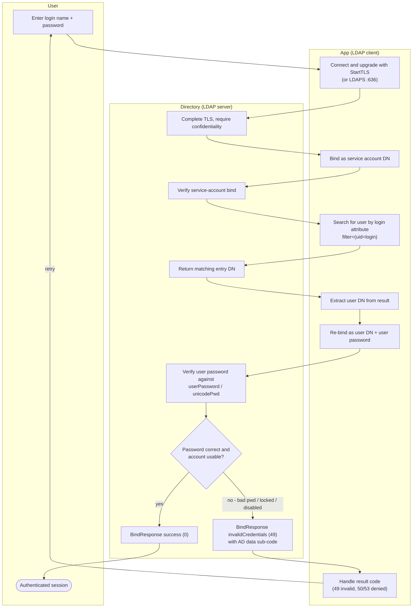

# LDAP Bind Authentication — Swimlane Diagram

One lane per actor. The search-then-bind pattern spans two round trips into the Directory.

Notes

- The App lane binds **twice**: once as the service account (to search), once as the user (to
  verify the password). Only the second bind proves the user's identity.
- A SASL `EXTERNAL` variant collapses this: the user's DN comes from the client certificate in
  the TLS handshake (D1), so no separate search or password bind is needed.
- The Directory lane enforces confidentiality at D1 so a cleartext simple bind can be refused
  before any password is accepted.
