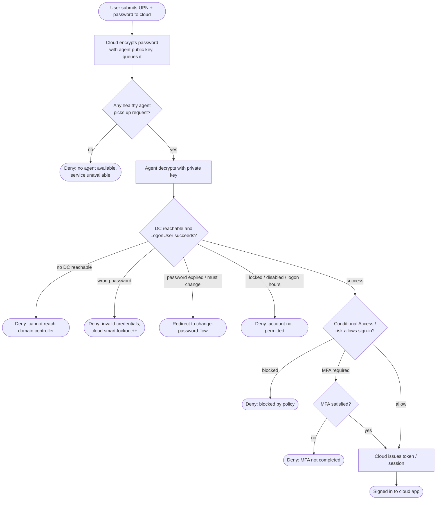

# Pass-Through Authentication — Decision Flowchart

Validation logic from cloud sign-in through on-prem DC verdict, with explicit error
terminals for each failure the domain controller can report.

Notes

- Availability is checked first: with no agent servicing the queue there is no cloud-side
  password fallback (unless PHS is separately enabled), so the sign-in simply fails.
- The domain controller is the authority for every credential and account-state verdict; the
  agent only relays that verdict and never caches a hash.
- The password check is a single factor — Conditional Access and MFA gates sit after a
  successful DC validation before a token is issued.
