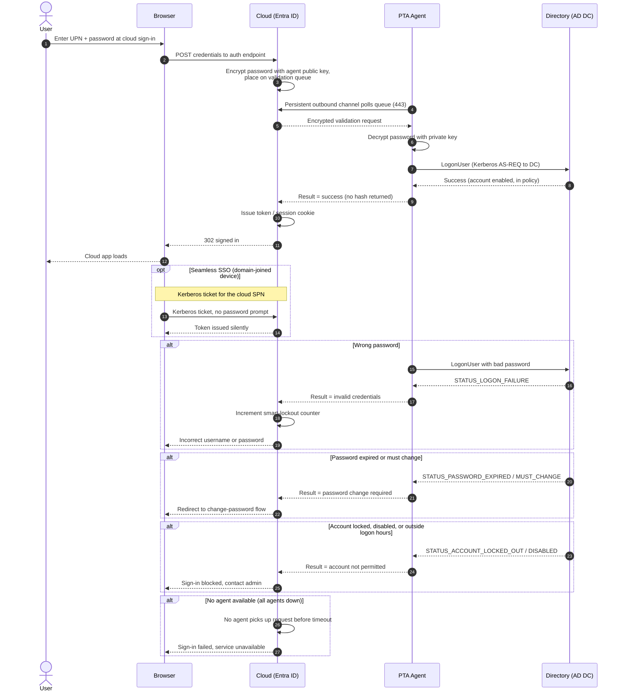

# Pass-Through Authentication — Sequence Diagram

Happy path first (cloud encrypts, on-prem agent validates against the DC), then wrong
password, password expired, locked/disabled account, no agent available, and Seamless SSO.

Notes

- The password is encrypted in the cloud with the agent's public key and decrypted only in
  agent memory, so no hash or plaintext is stored in the cloud.
- The agent's channel is outbound-only, it polls the cloud queue, the cloud never connects
  inbound to the agent.
- All on-prem account state (expiry, lockout, disabled, logon hours) is enforced live by the
  DC and surfaced back to the cloud as a specific sub-status.
