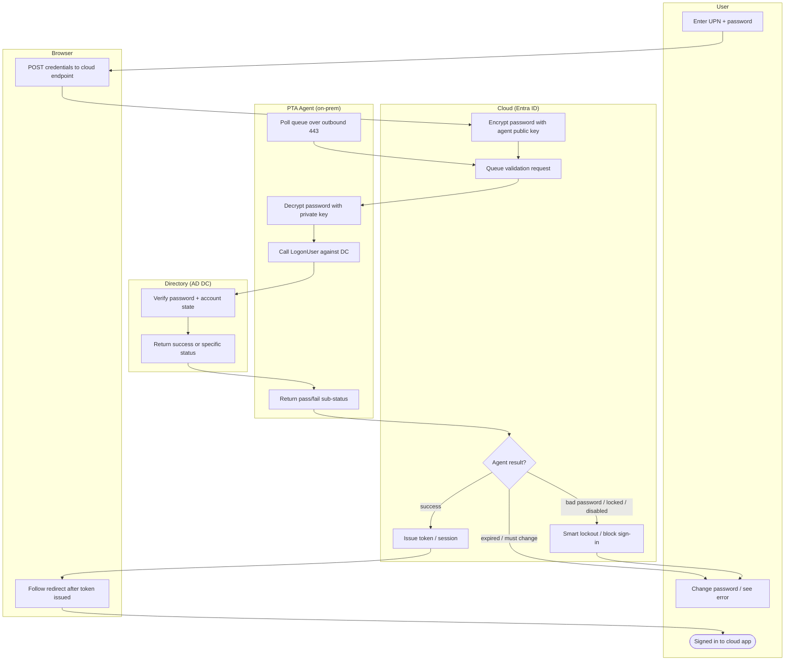

# Pass-Through Authentication — Swimlane Diagram

One lane per actor. The password is encrypted in the Cloud lane and only decrypted in the
Agent lane; the Directory lane holds the authoritative verdict.

Notes

- The `CL1`/`A2` split is the core of PTA: encryption happens in the cloud, decryption only
  on the on-prem agent, so no reusable secret is stored in the cloud.
- The agent lane always initiates the connection (`A1 --> CL2`), the cloud never reaches
  inbound to the agent.
- Every non-success verdict originates in the Directory lane (`D2`) and is faithfully
  relayed by the agent to the cloud — see [flowchart.md](flowchart.md) for the full tree.
