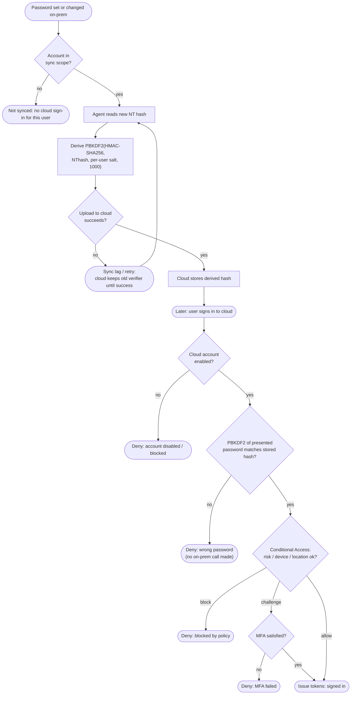

# Password Hash Sync — Decision Flowchart

Two decision domains: the sync pipeline that populates the cloud verifier, and the cloud-only
sign-in that consumes it. Error terminals are explicit.

Notes

- The sign-in branch never depends on the Directory being reachable — the match is against the
  stored cloud verifier, giving PHS its outage resilience.
- A disabled or out-of-scope on-prem account should sync as blocked / not-synced so cloud
  sign-in is denied; verify scoping so a leaver is actually stopped.
- Conditional Access and MFA gates run **after** a successful password match, so PHS composes
  with risk-based policy rather than replacing it.
